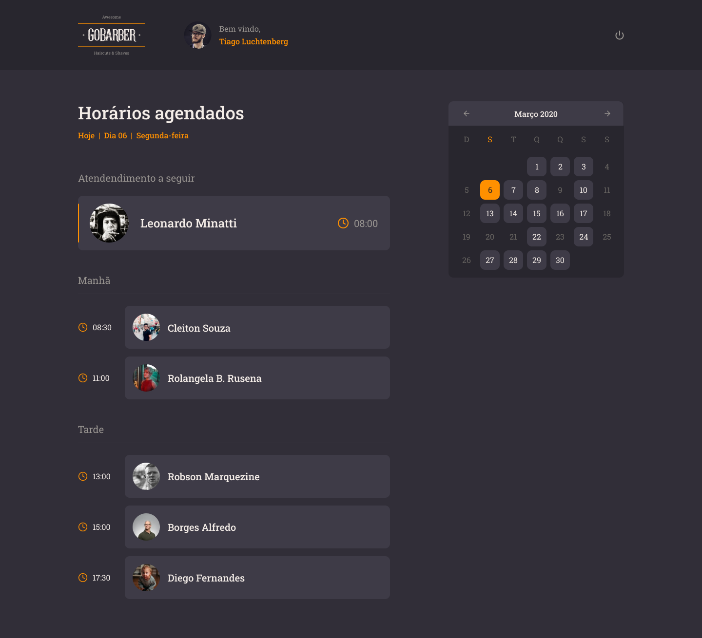

Nesta versão 3 utiliza-se de conceitos de React JS com a adição do Typescript

- Versão 1 (Nodejs e Nunjucks) pode ser encontrada [aqui](https://github.com/marlondenisck/nodejs-nunjucks-agendamento-servicos)

- A Versão 2 pode ser encontrada na TAG ```v2``` desde repositório, ou clique [aqui](https://github.com/marlondenisck/reactjs-agendamento-servicos/tree/v2) para um atalho.

